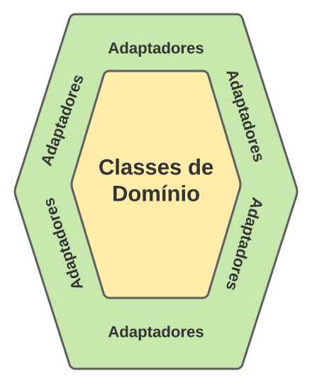
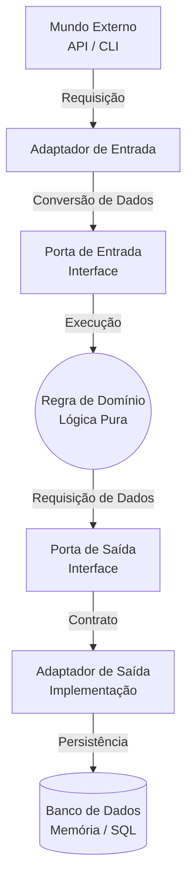

# Arquitetura Hexagonal (Ports and Adapters)

O padrão estabelece o isolamento absoluto das regras de domínio, protegendo-as de dependências externas. 
As classes de domínio não possuem conhecimento sobre a origem ou o destino dos dados; 
o fluxo de comunicação ocorre exclusivamente através de interfaces predefinidas.

## Portas e Adaptadores

* **Portas:** São as interfaces. Elas definem o contrato de comunicação.
  * *Entrada:* Declara os serviços que o sistema oferece ao exterior.
  * *Saída:* Declara as dependências que o sistema exige do exterior.
* **Adaptadores:** São as implementações concretas que traduzem a comunicação do sistema externo para os contratos das portas.

### Fluxo de Execução

