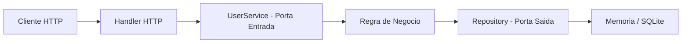

# Arquitetura Hexagonal (Ports and Adapters)

A ideia principal da arquitetura hexagonal e isolar as regras de negocio do resto do sistema (banco de dados, frameworks web, linha de comando).

## Conceitos basicos

- **Dominio / Core**: onde fica a logica de negocio pura e as entidades. Nao depende de nada de fora (sem http, sem sql).
- **Portas (Ports)**: sao as interfaces do Go. Definem os contratos de comunicacao.
  - *Entrada*: o que o servico oferece para o mundo externo chamar (ex: `UserService`).
  - *Saida*: o que o servico precisa para salvar ou buscar dados (ex: `UserRepository`, `Repository[T]`).
- **Adaptadores (Adapters)**: sao as implementacoes reais das interfaces.
  - *Entrada*: handlers HTTP, rotas, controladores (ex: `handler/user.go`).
  - *Saida*: implementacoes de banco ou memoria (ex: `adapters/inMemoryUserRepository.go`, `adapters/sqlite_repository.go`).

## Estrutura no projeto

- `internal/core`: regras de negocio, entidades e interfaces (portas).
- `internal/adapters`: implementacoes de persistencia em memoria e SQLite (adaptadores de saida).
- `handler`: rotas e controladores HTTP (adaptadores de entrada).

## Fluxo de uma requisicao

1. A requisicao HTTP chega no handler (`handler/user.go`).
2. O handler valida os dados e converte o JSON para o modelo de dominio (`core.User`).
3. O handler chama o servico do dominio (`core.UserService`).
4. O servico executa a regra de negocio e usa a interface do repositorio (`core.Repository[T]`).
5. O adaptador concreto (memoria ou SQLite) grava os dados.
6. A resposta volta formatada para o cliente.


```mermaid
flowchart LR
    A[Cliente HTTP] --> B[Handler HTTP]
    B --> C[UserService - Porta Entrada]
    C --> D[Regra de Negocio]
    D --> E[Repository - Porta Saida]
    E --> F[Memoria / SQLite]
```

## Trocando adaptadores de saida

Como o dominio depende exclusivamente da porta `UserRepository`, a troca de infraestrutura e feita na composicao inicial no `main.go`:

```go
// Opcao 1: Adaptador em memoria
adapter := adapters.NewInMemoryUserRepository()

// Opcao 2: Adaptador SQLite
db, _ := sql.Open("sqlite", "database.db")
adapter, _ := adapters.NewSQLiteUserRepository(db)

// O servico de dominio funciona de forma identica com qualquer um dos dois:
service := core.NewUserService(adapter)
```
