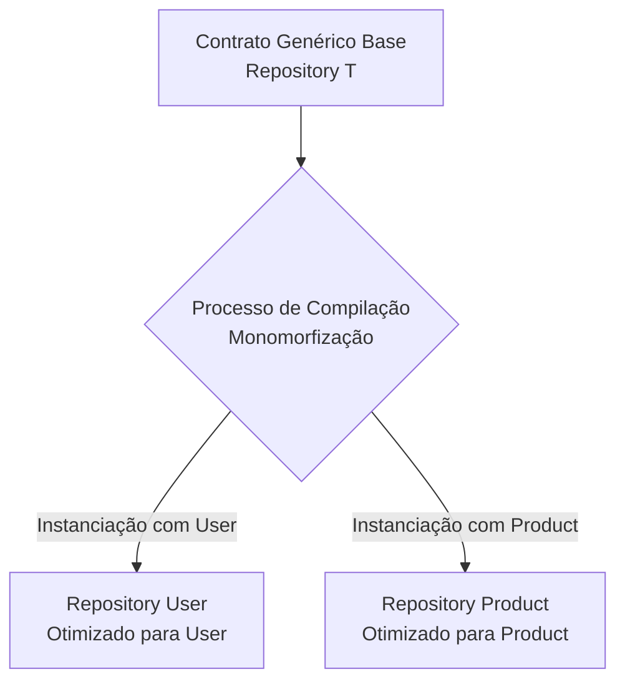
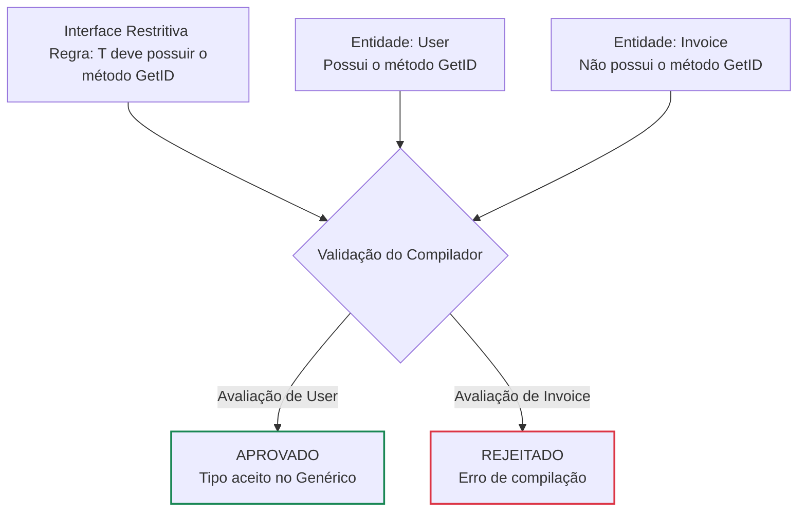

# Generics em Go

A utilização de Generics permite a criação de estruturas que operam de forma independente de um tipo específico de dado, eliminando a redundância estrutural sem comprometer a validação estática do compilador.

### Instanciação em Tempo de Compilação

O processo de compilação gera implementações estáticas exclusivas para cada tipo utilizado no sistema, evitando penalidades de desempenho em tempo de execução.

A Relação com Interfaces (Restrições)

Em Go, as interfaces operam como restrições (bounds) para os tipos genéricos. Elas estabelecem um filtro estrito: o parâmetro genérico só aceitará tipos que assinarem o contrato definido pela interface.
