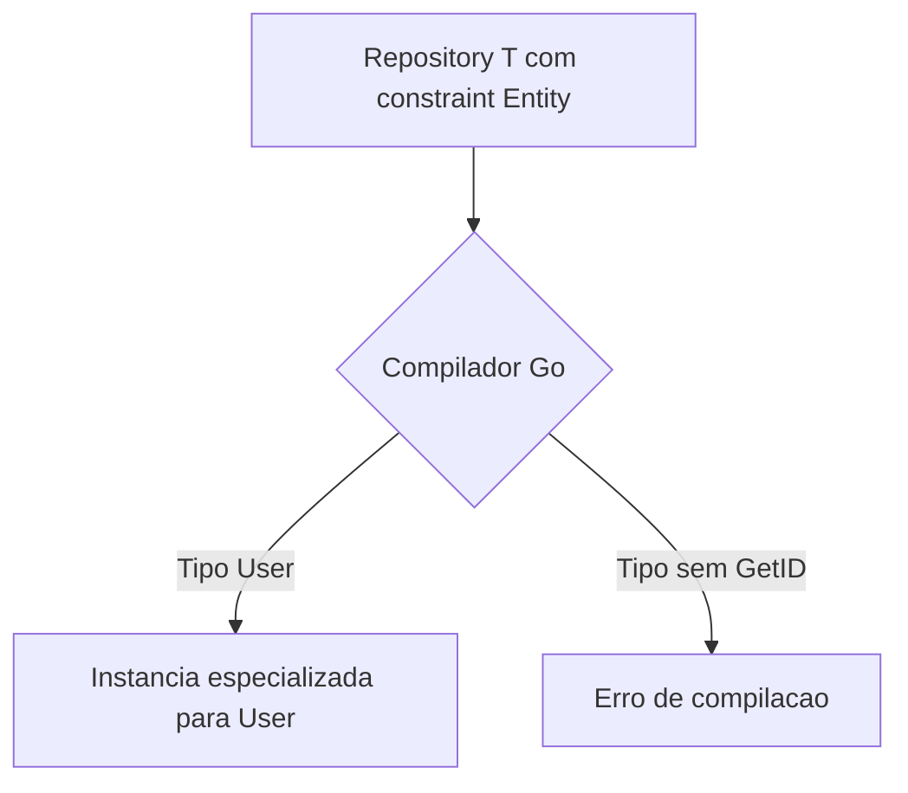

# Generics no Go

Anotacoes sobre o uso de Generics no projeto para evitar repeticao de codigo nos contratos de repositorio.

## Por que usar Generics aqui

Sem generics, para cada nova entidade (Usuario, Produto, etc.) seria necessario criar uma interface de repositorio e uma implementacao separada com praticamente os mesmos metodos (`Create`, `Update`, `FindByID`, `Delete`).

Com generics, criamos uma unica porta base: `Repository[T]`.

## Restricao com Interfaces (Constraints)

Para que o repositorio generico consiga pegar o ID de qualquer entidade, definimos uma interface restritiva:

```go
type Entity interface {
    GetID() string
}
```

Qualquer tipo que entrar no generic precisa implementar esse metodo.

## Exemplo no projeto

1. Definicao do contrato no core (`internal/core/repository.go`):
```go
type Repository[T Entity] interface {
    Create(entity T) (T, error)
    Update(entity T) (T, error)
    FindByID(id string) (T, error)
    FindAll() ([]T, error)
    Delete(id string) error
}
```

2. Entidade User satisfazendo a constraint (`internal/core/user.go`):
```go
func (u *User) GetID() string {
    return u.ID
}
```

3. Adaptador concreto (`internal/adapters/memory_repository.go`):
```go
repo := adapters.NewMemoryRepository[*core.User]()
```

## Como o compilador trata isso

O Go faz monomorfizacao durante a compilacao. Ele gera uma versao especializada do codigo para cada tipo usado, sem custo de desempenho em tempo de execucao e sem usar reflection (`reflect`) ou `interface{}`/`any` solto.


```mermaid
flowchart TD
    A[Repository T com constraint Entity] --> B{Compilador Go}
    B -->|Tipo User| C[Instancia especializada para User]
    B -->|Tipo sem GetID| D[Erro de compilacao]
```